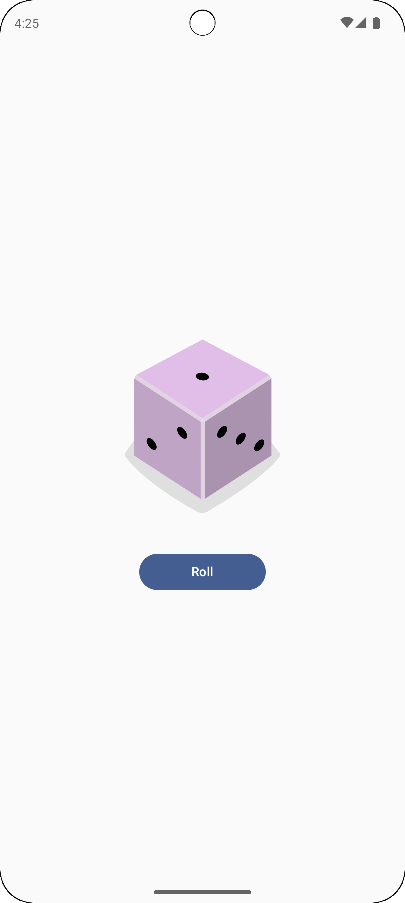

# Dice Roller App

A simple **Dice Roller** app that lets users roll a die and displays the result in an interactive and visually appealing way.


## Features

- **Interactive UI**: Displays a 3D dice that updates dynamically when rolled.
- **Single Tap Action**: Roll the dice by tapping the "Roll" button.
- **Randomized Outcomes**: Ensures a fair random number is generated on each roll.
- **Lightweight Design**: Minimalist interface for a smooth user experience.

## How It Works

1. The user taps the **Roll** button.
2. A random number between 1 and 6 is generated.
3. The dice image updates to reflect the result of the roll.

## Technologies Used

- **Kotlin**: For concise and modern Android app development.
- **Android Studio**: IDE used for building and testing the app.
- **Random Number Generator**: Core logic for dice rolling.

## How to Run the App

1. Clone the repository:
   ```bash
   git clone https://github.com/your-username/dice-roller.git
